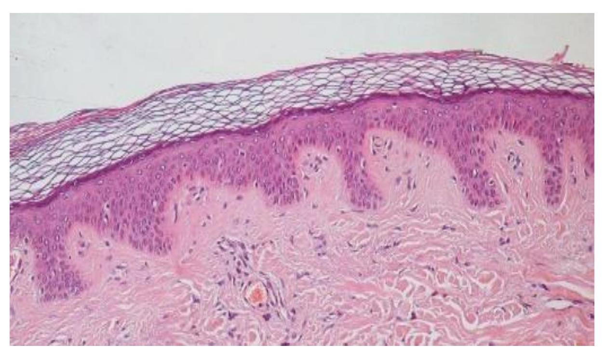
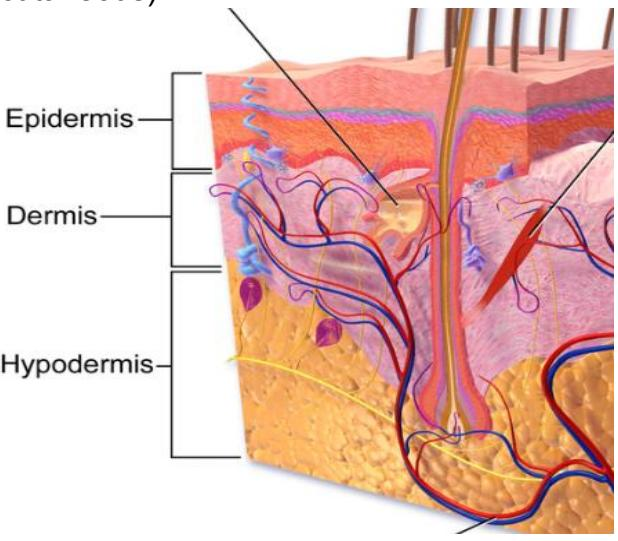
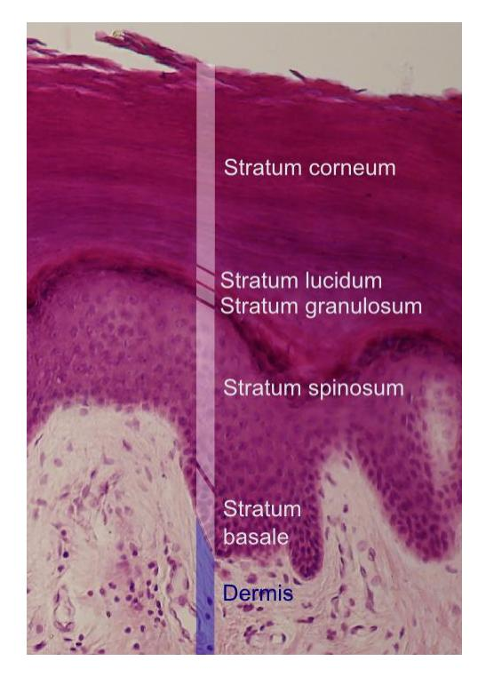
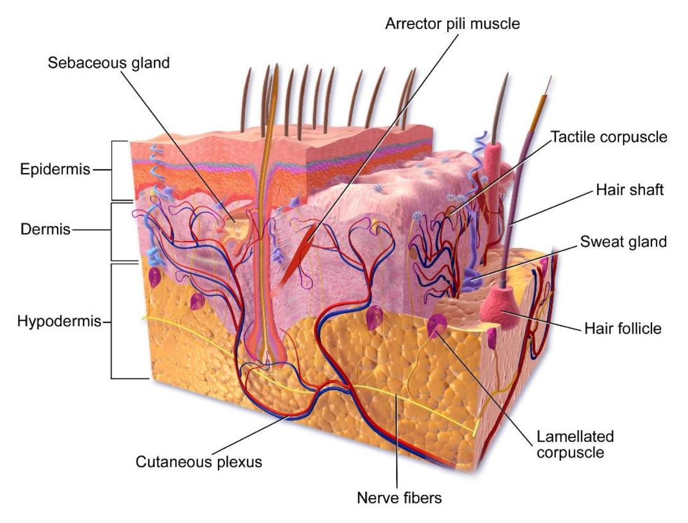
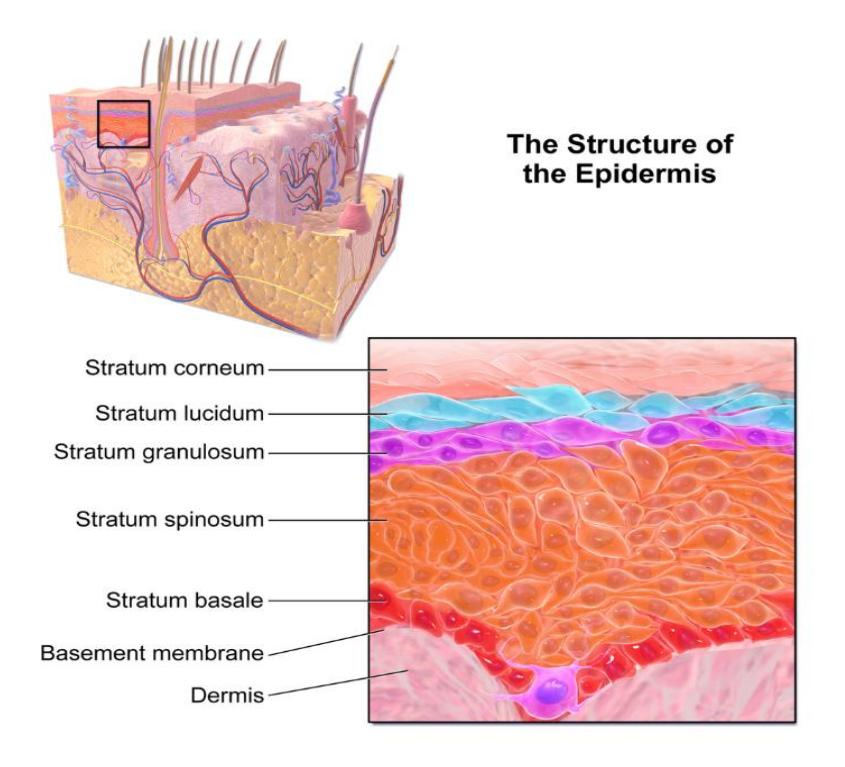
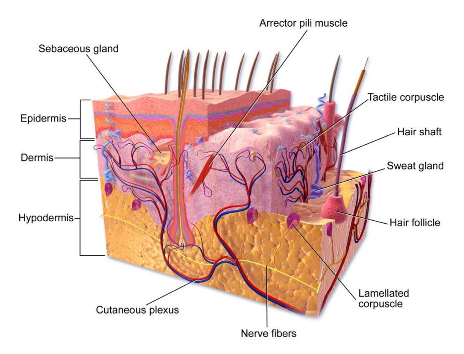
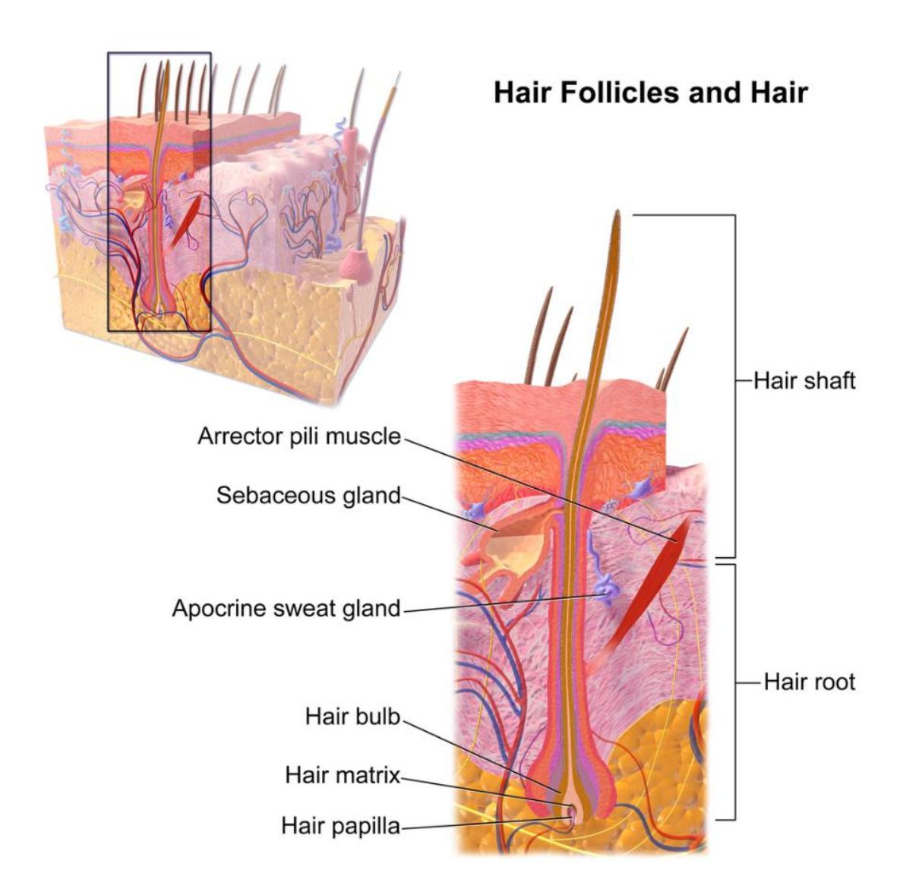
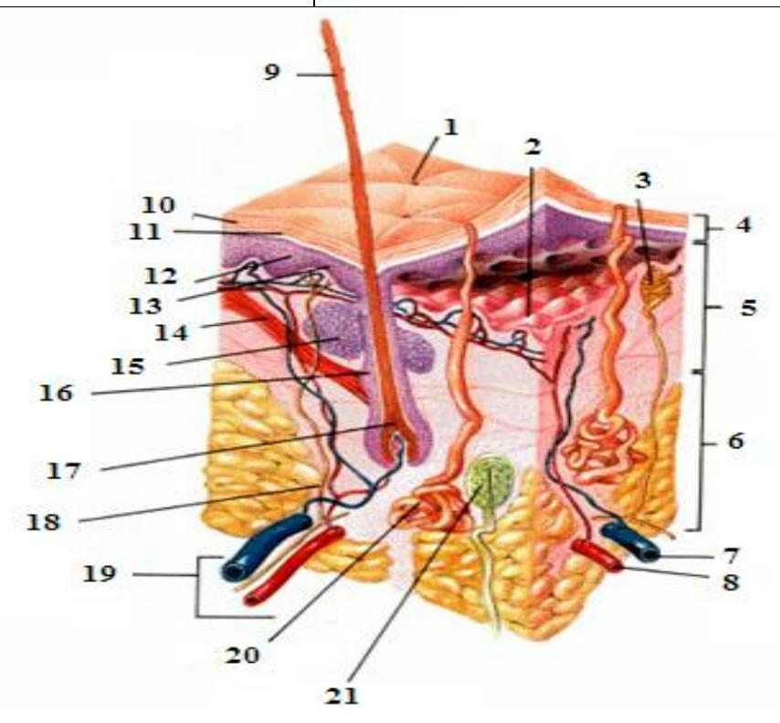

## **Integumentary System**

**Figure 5.1** The Integumentary System.

## **Course Objectives**

At the conclusion of this lab, you should be able to:

-   Describe the structure of the skin.
-   Describe the functions of the integumentary system.
-   Differentiate between the layers of the epidermis.
-   Identify the components of the dermis and their function.
-   Identify the layers of the Integumentary system on a model or a diagram.
    -   Layers and Sublayers of Cutaneous Membrane also be able to identify the epidermal layers on a model or a diagram (note: the layers are listed from superficial to deep)
        -   Stratum corneum
        -   Stratum lucidum thick skin only
        -   Stratum granulosum
        -   Stratum spinosum
        -   Stratum basale (germinitivum)
    -   Dermis
        -   Papillary layer
        -   Reticular layer
    -   Subcutaneous layer (hypodermis)
-   Using a model or diagram identify and describe the function of the following integumentary structures:
    -   Dermal papillae
    -   Hair shaft
    -   Hair root
    -   Hair follicle
    -   Pore
    -   Arrector pili muscle
    -   Sebaceous gland
    -   Merocrine (eccrine) sweat gland.
-   Apocrine sweat gland
-   Free nerve ending
-   Meissner's (tactile) corpuscle
-   Pacinian (pressure) corpuscle
-   Keratinocyte
-   Melanocyte

## **Prelab Activities**

## **Prelab Activity 5.1**

Using your textbook define or identify the following terms.

## Epidermal Layer

| Term | Definition |
|---------------------------------------------------|---------------------|
| Epidermis | Outer layer of skin; protection |
| Stratum corneum | Dead, keratinized cells; barrier |
| Stratum lucidum | Clear layer in thick skin only |
| Stratum granulosum | Keratin formation begins |
| Stratum spinosum | Provides strength; cell connections |
| Stratum basale (germinativum) | Deep layer; cell division occurs |
| Dermal Layer | Inner skin layer with blood vessels and nerves |

**Dermal Layer**

## Dermis and Hypodermis

| Term            | Definition                                               |
|------------------------------------------|------------------------------|
| Dermis          | Inner skin layer; contains blood vessels, nerves, glands |
| Papillary layer | Superficial dermis; loose tissue with capillaries        |
| Reticular layer | Deep dermis; dense tissue for strength and elasticity    |

| Term | Definition |
|----------------------------------------------------|--------------------|
| Subcutaneous Layer (Hypodermis) | Fat layer; insulation, energy storage, anchors skin |

**Integumentary Structures**

## Skin Structures

| Term | Definition |
|----------------------------------------------------|--------------------|
| Dermal papillae | Projections that increase surface area and nutrient exchange |
| Hair shaft | Visible part of hair above skin |
| Hair root | Part of hair below skin |
| Hair follicle | Structure that produces hair |
| Pore | Opening for sweat or oil glands |
| Arrector pili muscle | Muscle that raises hair (goosebumps) |
| Sebaceous gland | Produces oil (sebum) to lubricate skin |
| Merocrine (eccrine) sweat gland | Produces sweat for cooling |
| Apocrine sweat gland | Produces thicker sweat (odor) |
| Free nerve ending | Detects pain and temperature |
| Meissner's (tactile) corpuscle | Detects light touch |
| Pacinian (pressure) corpuscle | Detects deep pressure and vibration |
| Keratinocyte | Produces keratin for protection |
| Melanocyte | Produces melanin (skin color) |

## **Prelab Activity 5.2**

Using your textbook define or identify the following layers.

## Figure 5.2 – Integumentary System

### Layers

-   4: Epidermis\
-   5: Dermis\
-   6: Hypodermis (subcutaneous layer)

### Accessory Structures

-   15: Hair follicle\
-   21: Pacinian (pressure) corpuscle\
-   14: Sebaceous gland\
-   20: Arrector pili muscle

## **Lab Activities**

## **Integumentary System**

**Figure 5.3** Photomicrograph of a Section of Thick Skin.

## **General Functions of the Integumentary System**

The Integumentary system functions include but are not limited to the following functions:

-   protection from physical damage or chemical or biological agents,
-   water, and temperature regulation,
-   sensory,
-   synthesis of vitamin D,
-   fat storage.

## **Layers of the Skin and the Hypodermis**

### **Terms**

-   Epidermis
-   Dermis
-   Hypodermis (Subcutaneous)

**Figure 5.4** Diagram of the Integument Layers.

### **Epidermal Layers and their Function**

**Figure 5.5 Layers of the Epidermis**

**Table 5.1 Epidermal Layers (Listed Superficial to Deep)**

## Epidermal Layers – Major Features

| Epidermal Layer               | Major Features                             |
|-----------------------------------------------|-------------------------|
| Stratum corneum               | Dead keratinized cells; protective barrier |
| Stratum lucidum               | Clear layer in thick skin only             |
| Stratum granulosum            | Keratin production; cells begin to die     |
| Stratum spinosum              | Strength and cell connections              |
| Stratum basale (germinitivum) | Cell division; new cells form              |

## **Lab Activities**

## **Lab Activity 5.1**

## **Anatomy of the Integumentary System**

-   Obtain a model of Hubbard TM Scientific or a 3D model of the integumentary system.
-   Take a picture of one of the models of the integumentary system available in the lab with your cell phone. Label and identify the epidermis, dermis, and the hypodermis.
-   Set up a microscope with a slide of the skin. Focus on the integument and take a picture (photomicrograph) of the slide with your cellphone. Identify the epidermis, dermis, and the hypodermis.
    -   Epidermis.
        -   Identify the type of cells that comprise this layer.
        -   Determine if there are blood vessels in this layer.
        -   Label the apical and basal surfaces of this layer.
    -   Dermis
        -   Notice that the interface between the dermal and epidermal layers is uneven. The projections are called dermal papillae. Find this interface on the model before you and label them.
        -   Do the same for these structures in your picture.

## **Anatomy of the Epidermis**

**Figure 5.6 Layers of the Integumentary system. Comparison of the structure of thick skin vs thin skin.**

### **Lab Activity 5.1:**

## **The Anatomy of the Integumentary System continued**

-   Compare the thick and thin skin models, or pictures, of the skin.
    -   What differences do you note in their appearance and structure?
    -   Where is each type located on the body? From this observation provide an explanation of each skin type's function.
    -   Identify and describe the layers of each type of skin.
-   Find a picture of the epidermis on the internet and print the picture.
    -   Label all of the layers of the epidermis
    -   Provide a description of each layer of the epidermis on the table below.

**Table 5.2 Epidermal layers listed superficial to deep.**

## Epidermal Layers – Description

| Epidermal Layer    | Description                            |
|--------------------|----------------------------------------|
| Stratum corneum    | Dead, keratinized cells for protection |
| Stratum lucidum    | Clear layer in thick skin only         |
| Stratum granulosum | Keratin forms; cells begin to die      |
| Stratum spinosum   | Provides strength; cells connected     |
| Stratum basale     | Cell division; new cells produced      |

### **Lab Activity 5.2:**

## **Dermis**

-   Using one of the lab models, with the assistance of the picture below, locate the two layers of the dermis.
    -   Locate the papillary ridge.
    -   Identify the type of connective tissue in each layer.

**Figure 5.7** Epidermis, Papillary Dermis and Reticular Dermis.

## **Lab Activity 5.3:**

-   Using a model, with the assistance of the following diagram, identify and describe the function of the following integumentary structures.
-   Identify and label the structures indicated below.
-   Have your instructor check your work.
-   Take a picture to use as a study guide.

## **Dermal Structures**

-   Dermal papillae
-   Hair shaft
-   Hair root
-   Hair follicle
-   Pore
-   Arrector pili muscle
-   Sebaceous gland
-   Merocrine (eccrine) sweat gland.
-   Apocrine sweat gland
-   Free nerve ending
-   Meissner's (tactile) corpuscle
-   Pacinian (pressure) corpuscle
-   Keratinocyte
-   Melanocyte

**Figure 5.8** Anatomy of Human Skin.

## **Lab Activity 5.4:**

Describe the function of each of the listed dermal structures.

**Table 5.3 Table of the Dermal Structures and their Function**

## Dermal Structures – Functions

| Dermal Structure                | Function(s)                              |
|---------------------------------------------------|---------------------|
| Dermal papillae                 | Increase surface area; nourish epidermis |
| Pore                            | Opening for sweat and oil release        |
| Arrector pili muscle            | Raises hair (goosebumps)                 |
| Sebaceous gland                 | Secretes oil (sebum)                     |
| Merocrine (eccrine) sweat gland | Produces sweat for cooling               |
| Apocrine sweat gland            | Produces thicker sweat (odor)            |
| Free nerve ending               | Detects pain and temperature             |
| Meissner's (tactile) corpuscle  | Detects light touch                      |
| Pacinian (pressure) corpuscle   | Detects deep pressure                    |
| Keratinocyte                    | Produces keratin                         |
| Melanocyte                      | Produces melanin                         |

## **Epidermis**

The epidermis consists of stratified epithelial tissue which is primarily composed of keratinocytes. Keratinocytes produce the protein keratin which waterproofs the cells as well as provides additional strength and protection. Other cells found within this layer are the melanocytes, which produce the pigment melanin and the Langerhans cells that provide an immune function.

**Figure 5.9** Structure of the Epidermis.

Epidermal Layers: the layers or strata progression from the superficial to the deep layers.

## **Characteristics of this Layer:**

-   Mostly keratinocytes
-   reproductive actively mitotic division
-   produce keratin with cell progression upward keratinization.

### **Strata of the Epidermis:**

-   superficial stratum stratum corneum
-   intermediate stratum
    -   stratum lucidum absent in "thin" skin.
    -   stratum granulosum
    -   stratum spinosum
-   bottom stratum stratum basale (germinitivum)

## **Skin Pigmentation**

Melanocytes. Melanocytes are located in the stratum basale as can be noted in Figures 5.10 & 5.11.

**Figure 5.10** Epidermis with Melanocyte.

**Figure 5.11** Examples of Melanocytes in the Basal Layer of the Epidermis.

## **Dermal and Subcutaneous Layers**

## **Layers of the Dermis**

-   Papillary layer
-   Reticular layer

**Figure 5.12** Layers of the dermis.

## **Hypodermis (Subcutaneous)**

**Figure 5.13** Anatomy of the Skin.

## **Dermal and Hypodermal Structures**

Using a model or diagram of the integumentary system, identify and describe the function of the following integumentary structures:

-   Dermal papillae
-   Hair shaft
-   Hair root
-   Hair follicle
-   Pore
-   Arrector pili muscle

**Figure 5.14.**

**Figure 5.14** Hair Follicle.

## **Post Lab Activities**

## **Test your recall:**

## **Post Lab Activity 5.1: Answer the concept questions**

## Integumentary System Questions

-   Name the layers of the dermis.\
    Papillary layer\
    Reticular layer

-   List three major types of glands associated with the integumentary system and describe their function.\
    Sebaceous glands – produce oil (sebum)\
    Eccrine sweat glands – regulate body temperature\
    Apocrine glands – produce thicker sweat (odor)

-   What are the three protective functions of the integumentary system?\
    Protection from physical damage\
    Protection from pathogens\
    Prevents water loss\
    \## **Post Lab Activity 5.2**

## **Matching**

## **Table 5.4 Matching: Write the Letter of the Definition in the Column to the Left of the Term**

| \# | Terms | Definitions |
|--------------|--------------|-------------------------------------------|
| 1 | Pore | a\. The part of a hair projecting beyond the surface of the skin |
| 2 | Arrector pili muscle | b\. An onion-shaped structure that is responsible for sensitivity to vibration and pressure |
| 3 | Meissner's corpuscle | c\. Any of the small sacculated glands lodged in the substance of the derma, usually opening into the hair follicles, and secreting an oily material |
| 4 | Pacinian corpuscle | d\. An organ found in mammalian skin which regulates hair growth |
| 5 | Keratinocyte | e\. A small opening or empty space. |
| 6 | Apocrine sweat gland | f\. The enlarged basal part of a hair within the skin |
| 7 | Hair follicle | g\. A type of nerve ending in the skin that is responsible for sensitivity to pressure |
| 8 | Dermal papillae | h\. The small smooth muscles associated with the base of each hair that contract when the body surface is chilled and erect the hairs |
| 9 | Merocrine sweat gland | i\. Glands found in places like the armpits, scrotum, and anus. They tend to open into hair follicles instead of hairless areas of skin. |
| 10 | Hair root | j\. An unspecialized, afferent nerve fiber ending of a sensory neuron |
| 11 | Sebaceous gland | k\. An epidermal cell that produces keratin. |
| 12 | Free nerve ending | l\. True sweat glands in the sense of helping to regulate body temperature |
| 13 | Hair shaft | m\. Any vascular protuberance of the skin's dermal layer extending into the epidermal layer, often containing tactile corpuscles |

Match the following terms with the correct parts in figure 5.15.

**Table 5.5 Identification of the Dermal Structures**

## Dermal Structures – Figure 5.15

| Dermal Structure      | Number on Figure 5.15 |
|-----------------------|-----------------------|
| Pore                  | 1                     |
| Arrector pili muscle  | 2                     |
| Meissner's corpuscle  | 3                     |
| Pacinian corpuscle    | 4                     |
| Keratinocyte          | 5                     |
| Apocrine sweat gland  | 6                     |
| Hair follicle         | 7                     |
| Dermal papillae       | 8                     |
| Merocrine sweat gland | 9                     |
| Hair root             | 10                    |
| Sebaceous gland       | 11                    |
| Free nerve ending     | 12                    |
| Hair shaft            | 13                    |

**Figure 5.15** Anatomy of Human Skin Sans Labels.

Match the statement blank with the correct answer.

**Table 5.6 Match the statement with the best answer.**

## Integumentary System Matching

| Answer | Statement | Correct Answer |
|----------------|----------------------------------------|----------------|
| a\. | The epidermis is composed of \_\_\_\_\_\_\_\_\_\_. | squamous epithelial tissue |
| b\. | The deepest layer of the epidermis. | stratum basale |
| c\. | The majority of the cells of the epidermis are \_\_\_\_\_\_\_\_\_\_, so-called because they make \_\_\_\_\_\_\_\_\_\_. | keratinocytes; keratin |
| d\. | Melanocytes are located in the \_\_\_\_\_\_\_\_\_\_ (which layer?). | stratum basale |
| e\. | Immune cells in the stratum spinosum which protect against invaders are the \_\_\_\_\_\_\_\_\_\_. | Langerhans' cells |
| f\. | A very thin layer called the \_\_\_\_\_\_\_\_\_\_ is in the epidermis but is visible only in thick skin. | stratum lucidum |
| g\. | The first level of protection against abrasion and toxic chemicals at the body's surface is provided by the \_\_\_\_\_\_\_\_\_\_. | stratum corneum |
| h\. | The dermis consists of two layers: the \_\_\_\_\_\_\_\_\_\_, which is characterized by a dimpled interface with the epidermis, and the \_\_\_\_\_\_\_\_\_\_, which accounts for 80% of the skin's thickness | papillary layer; reticular layer |
| i\. | The reticular layer of the dermis contains \_\_\_\_\_\_\_\_\_\_ to sense firm pressure. | Pacinian corpuscles |
| j\. | Apocrine and eccrine glands are both \_\_\_\_\_\_\_\_\_\_ (sweat) glands. | sudoriferous |
| k\. | \_\_\_\_\_\_\_\_\_\_ glands produce a waxy substance to protect the ear canal from dust, small insects, etc. | ceruminous |
| l\. | The portion of the hair that is above the surface of the skin is called the \_\_\_\_\_\_\_\_\_\_. | hair shaft |
| m\. | The sub-surface portion of the hair is called the \_\_\_\_\_\_\_\_\_\_. | root |
| n\. | The origin of the hair shaft, deep within the dermis, is called the \_\_\_\_\_\_\_\_\_\_. | hair bulb |
| o\. | The sheath in which a hair is held is called \_\_\_\_\_\_\_\_\_\_. | follicle |

## **Post Lab Activity 5.3**

**Crossword Puzzle:** Complete the following crossword puzzle.

**Figure 5.16 The Integumentary System**

### **Across**

## Integumentary System Crossword

### Across

-   **7** Reticular layer\
-   **8** Stratum granulosum\
-   **9** Epidermis

### Down

-   **1** Stratum corneum\
-   **2** Papillary layer\
-   **3** Hypodermis\
-   **4** Stratum spinosum\
-   **5** Stratum basale\
-   **6** Stratum lucidum\
    \## **Post Lab Activity 5.4**

## **Check Your Understanding**

## Integumentary System Application Questions

-   You are a medical examiner… list the layers from superficial to deep:\
    Epidermis → Dermis → Hypodermis (subcutaneous layer)

------------------------------------------------------------------------

-   Why is the GP not concerned about the baby’s yellow/orange skin?\
    The condition is **carotenemia**, caused by excess beta-carotene from foods like carrots and squash. It is harmless and not related to liver disease.

------------------------------------------------------------------------

-   How does the skin regulate body temperature when it rises?\
    Sweat glands produce sweat for cooling, and blood vessels dilate (vasodilation) to release heat.

------------------------------------------------------------------------

-   Why are light-skinned individuals more susceptible to melanoma?\
    They have less melanin, which provides protection against UV radiation, increasing DNA damage risk.

## **Post Lab Activity 5.5**

## **Test Your Recall**

Label the layers and structures of the epidermis.

**Figure 5.17** Layers of the Epidermis.

Using the picture below, identify the substructures within the following accessory structures.

-   Hair shaft
-   Hair root
-   Hair bulb
-   Hair follicle
-   Arrector pili muscle
-   Sebaceous gland
-   Apocrine sweat gland

**Figure 5.18** Illustration from Anatomy & Physiology of the Epidermis**.**

## **Post Lab Activity 5.6**

## **Fill in the blanks**

## Integumentary System Review

-   Name the layers of the dermis.\
    Papillary layer\
    Reticular layer

------------------------------------------------------------------------

|   | List three major types of glands associated with the integumentary system and describe their function. |
|-------------|----------------------------------------------------------|
| a\) | Sebaceous glands – secrete oil (sebum) |
| b\) | Eccrine (merocrine) glands – produce sweat for cooling |
| c\) | Apocrine glands – produce thicker sweat (odor) |

------------------------------------------------------------------------

|     | What are the three protective functions of the integumentary system? |
|-------------|----------------------------------------------------------|
| a\) | Protection from physical damage                                      |
| b\) | Protection from pathogens                                            |
| c\) | Prevents water loss                                                  |

------------------------------------------------------------------------

|     | List four functions of the integumentary system |
|-----|-------------------------------------------------|
| a\) | Protection                                      |
| b\) | Temperature regulation                          |
| c\) | Sensation                                       |
| d\) | Vitamin D production                            |

------------------------------------------------------------------------

-   The skin is composed of what type of epithelial tissue?\
    Stratified squamous epithelium

------------------------------------------------------------------------

| 1\) | List the five layers of the epidermis found in thick skin. Indicate which layer is not present in thin skin. |
|-------------|-----------------------------------------------------------|
| a\) | Stratum basale |
| b\) | Stratum spinosum |
| c\) | Stratum granulosum |
| d\) | Stratum lucidum *(not in thin skin)* |
| e\) | Stratum corneum |

------------------------------------------------------------------------

| 2\) | Identify four accessory structures found in the dermis, describe their function. |
|-------------|-----------------------------------------------------------|
| a\) | Hair follicle – produces hair |
| b\) | Sebaceous gland – secretes oil |
| c\) | Sweat gland – produces sweat |
| d\) | Arrector pili muscle – raises hair |

## **Answer keys**

#### Crossword Puzzle

**Across:**\
7. Reticular layer\
8. Stratum granulosum\
9. Epidermis

**Down:**\
1. Stratum corneum\
2. Papillary layer\
3. Hypodermis\
4. Stratum spinosum\
5. Stratum basale\
6. Stratum lucidum

**Chapter 5: Integumentary System**

| Key Terms | Definitions |
|-----------------------|-------------------------------------------------|
| acne | skin condition due to infected sebaceous glands |
| albinism | genetic disorder that affects the skin, in which there is no melanin production |
| apocrine sweat gland | sweat gland that is armpits and genital regions |
| arrector pili | smooth muscle that is activated in response to external stimuli that pull on hair follicles and make the hair "stand-up" |
| basal cell | type of stem cell found in the stratum basale and in the hair matrix that continually undergoes cell division, producing the keratinocytes of the epidermis |
| basal cell carcinoma | cancer that originates from basal cells in the epidermis of the skin |
| bedsore | sore on the skin that develops when regions of the body start necrotizing due to constant pressure and lack of blood supply; also called decubitus ulcers |
| callus | thickened area of skin that arises due to constant abrasion |
| corn | type of callus that is named for its shape and the elliptical motion of the abrasive force |
| cortex | in hair, the second or middle layer of keratinocytes originating from the hair matrix, as seen in a cross-section of the hair bulb |
| cuticle | in hair, the outermost layer of keratinocytes originating from the hair matrix, as seen in a cross section of the hair bulb |
| dermal papilla (plural = dermal papillae) | extension of the papillary layer of the dermis that increases surface contact between the epidermis and dermis |
| dermis | layer of skin between the epidermis and hypodermis, composed mainly of connective tissue and containing blood vessels, hair follicles, sweat glands, and other structures |
| desmosome | structure that forms an impermeable junction between cells |
| eccrine sweat gland | sweat gland that is common throughout the skin surface; it produces a hypotonic sweat for thermoregulation |
| eczema | skin condition due to an allergic reaction, which resembles a rash |
| elastin fibers | fibers made of the protein elastin that increase the elasticity of the dermis |
| epidermis | outermost tissue layer of the skin |
| external root | outer layer of the hair follicle that is an extension of the epidermis, which |
| sheath | encloses the hair root |
| first-degree burn | superficial burn that injures only the epidermis |
| fourth-degree burn | burn in which full thickness of the skin and underlying muscle and bone is damaged |
| free nerve ending | a.k.a. bare nerve ending, is an unspecialized, afferent nerve fiber sending its signal to a sensory neuron. |
| hair | keratinous filament growing out of the epidermis |
| hair bulb | structure at the base of the hair root that surrounds the dermal papilla |
| hair follicle | cavity or sac from which hair originates |
| hair matrix | layer of basal cells from which a strand of hair grows |
| hair papilla | mass of connective tissue, blood capillaries, and nerve endings at the base of the hair follicle |
| hair root | part of hair that is below the epidermis anchored to the follicle |
| hair shaft | part of hair that is above the epidermis but is not anchored to the follicle |
| hypodermis | connective tissue connecting the integument to the underlying bone and muscle |
| hyponychium | thickened layer of stratum corneum that lies below the free edge of the nail |
| integumentary system | skin and its accessory structures |
| internal root sheath | innermost layer of keratinocytes in the hair follicle that surround the hair root up to the hair shaft |
| keloid scar | scar that has layers raised above the skin surface |
| keratin | structural protein that gives skin, hair, and nails its hard, water-resistant properties |
| keratinocyte | cell that produces keratin and is the most predominant type of cell found in the epidermis |
| Langerhans cell | specialized dendritic cell found in the stratum spinosum that functions as a macrophage |
| lunula layer of thick epithelium | basal part of the nail body that consists of a crescent-shaped layer of thick epithelium |
| medulla | in hair, the innermost layer of keratinocytes originating from the hair matrix |
| Meissner corpuscle (also, tactile corpuscle) | in the skin that responds to light touch |
| melanin | pigment that determines the color of hair and skin |
| melanocyte | cell found in the stratum basale of the epidermis that produces the pigment melanin |
| melanoma | type of skin cancer that originates from the melanocytes of the skin |
| melanosome | intercellular vesicle that transfers melanin from melanocytes into keratinocytes of the epidermis |
| merocrine gland | See eccrine gland |
| Merkel cell | receptor cell in the stratum basale of the epidermis that responds to the sense of touch |
| metastasis | spread of cancer cells from a source to other parts of the body |
| nail bed | layer of epidermis upon which the nail body forms |
| nail body | main keratinous plate that forms the nail |
| nail cuticle | fold of epithelium that extends over the nail bed, also called the eponychium |
| nail fold | fold of epithelium at that extend over the sides of the nail body, holding it in place nail root part of the nail that is lodged deep in the epidermis from which the nail grows |
| Pacinian corpuscle (also, lamellated corpuscle) | receptor in the skin that responds to vibration |
| papillary layer | superficial layer of the dermis, made of loose, areolar connective tissue |
| reticular layer | deeper layer of the dermis; it has a reticulated appearance due to the presence of abundant collagen and elastin fibers |
| rickets | disease in children caused by vitamin D deficiency, which leads to the weakening of bones |
| scar | collagen-rich skin formed after the process of wound healing that is different from normal skin |
| sebaceous gland | type of oil gland found in the dermis all over the body and helps to lubricate and waterproof the skin and hair by secreting sebum |
| sebum | oily substance that is composed of a mixture of lipids that lubricates the skin and hair |
| second-degree burn | partial thickness burn that injures the epidermis and a portion of the dermis |
| squamous cell | type of skin cancer that originates from the stratum spinosum of the |
| carcinoma | epidermis |
| stratum basale | deepest layer of the epidermis, made of epidermal stem cells |
| stratum corneum | most superficial layer of the epidermis |
| stratum granulosum | layer of the epidermis superficial to the stratum spinosum |
| stratum lucidum | layer of the epidermis between the stratum granulosum and stratum corneum, found only in thick skin covering the palms, soles of the feet, and digits |
| stratum spinosum | layer of the epidermis superficial to the stratum basale, characterized by the presence of desmosomes |
| sudoriferous gland | sweat gland |
| third-degree burn | burn that penetrates and destroys the full thickness of the skin (epidermis and dermis) |
| vitamin D | compound that aids absorption of calcium and phosphates in the intestine to improve bone health |
| vitiligo | skin condition in which melanocytes in certain areas lose the ability to produce melanin, possibly due an autoimmune reaction that leads to loss of color in patches |
