# **Skeletal Muscle Histology and Microanatomy**

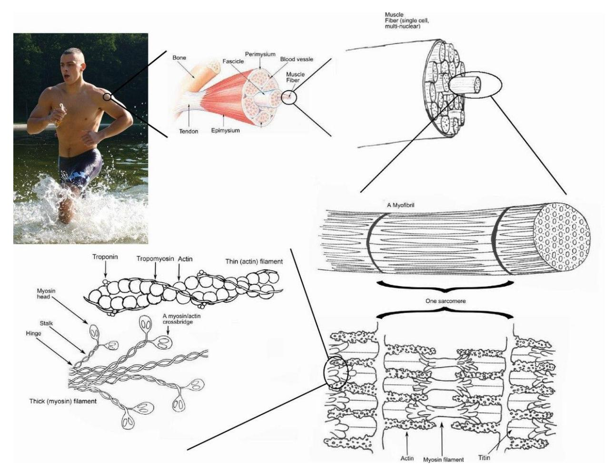

**Figure 10.1 Skeletal Muscle Histology**

## **Objectives**

The objectives of this lab are to complete the following:

## Muscle Tissue

### Locations

- Skeletal muscle **attached to bones (e.g., arms, legs)**  
- Smooth muscle **walls of organs (stomach, intestines, blood vessels)**  
- Cardiac muscle **heart only**  

---

### Comparison of Muscle Types

| Feature | Skeletal Muscle | Smooth Muscle | Cardiac Muscle |
|--------|-----------------|---------------|----------------|
| Shape | Long, cylindrical | Tapered (spindle-shaped) | Branching |
| Control | Voluntary | Involuntary | Involuntary |
| Striations | Yes | No | Yes |
| Nuclei | Multiple | Single | Single |
| Special features | Attached to bones | Lines organs | Intercalated discs |

---

### Key Characteristics

- Skeletal muscle  
  - Long cord-like, nonbranching  
  - Voluntary  
  - Striated  
  - Multiple nuclei  

- Smooth muscle  
  - Tapered cells  
  - Involuntary  
  - Non-striated  
  - Single nucleus  

- Cardiac muscle  
  - Branching cells  
  - Striated  
  - Intercalated discs  
  - Single nucleus  
## Muscle Fiber Structures

- Endomysium **thin connective tissue around each muscle fiber; supports and protects**  
- Sarcolemma **cell membrane of muscle fiber; conducts signals**  
- T-tubule **invaginations of sarcolemma; carry signals deep into cell**  
- Mitochondria **produce ATP (energy for contraction)**  
- Sarcoplasmic reticulum **stores and releases calcium for contraction**  
- Sarcomere **functional unit of contraction (Z line to Z line)**  
- Myofibril **bundles of contractile proteins inside fiber**  
- Neuromuscular junction (NMJ) **site where neuron communicates with muscle fiber**  

---

## Skeletal Muscle (Cross Section)

- Epimysium **outer layer around entire muscle**  
- Perimysium **surrounds fascicles (bundles of fibers)**  
- Fascicle **bundle of muscle fibers**  
- Endomysium **surrounds each muscle fiber**  
- Muscle fiber **individual muscle cell**  

---

## Myofibril Structure

- Myofilaments **protein filaments responsible for contraction**  

  - Z disc **boundary of sarcomere; anchors actin**  
  - M line **center of sarcomere; anchors myosin**  
  - I band **light region; thin filaments only**  
  - H zone **center region; thick filaments only**  
  - A band **dark region; thick + thin overlap**  

- Thick filament **myosin; pulls during contraction**  
- Myosin **motor protein that generates force**  
- Thin filament **actin; pulled by myosin**  
- Actin **protein forming thin filament**  
- Troponin **binds calcium to allow contraction**  
- Tropomyosin **blocks/unblocks actin binding sites**  

---

## Neuromuscular Junction (NMJ)

- Axon **nerve fiber carrying signal**  
- Axon terminals **end of neuron; releases neurotransmitter**  
- Synaptic vesicles **store acetylcholine (ACh)**  
- Synaptic cleft **gap between neuron and muscle**  
- Acetylcholine (ACh) **neurotransmitter that triggers contraction**  
- Motor neuron **nerve cell controlling muscle**  
- Axon terminal **releases ACh to muscle fiber**  

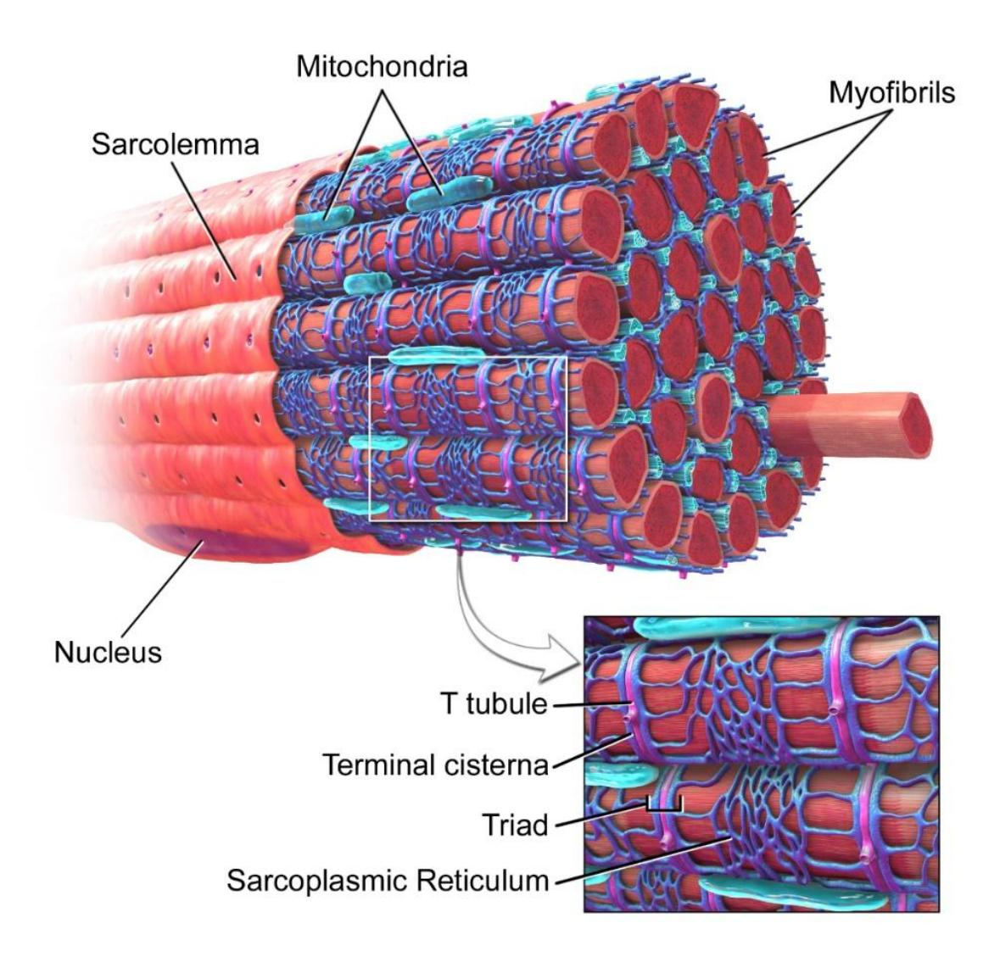

Figure 10.2 Skeletal Muscle Fiber.

## **Prelab Activities**

## **Prelab Activity 10.1**

## **Definitions Muscle Structures**
## Muscle Structure Terms

| Term                    | Definition |
|-------------------------|------------|
| tendon                  | connects muscle to bone |
| epimysium               | outer connective tissue covering whole muscle |
| fascicle                | bundle of muscle fibers |
| muscle fiber            | individual muscle cell |
| endomysium              | connective tissue around each muscle fiber |
| sarcolemma              | cell membrane of muscle fiber |
| nucleus                 | control center of cell; contains DNA |
| sarcoplasm              | cytoplasm of muscle cell |
| mitochondria            | produces ATP (energy) |
| sarcoplasmic reticulum  | stores and releases calcium |
| T or transverse tubules | carry electrical signals into muscle fiber |
| myofibrils              | bundles of contractile proteins |
| myofilaments            | actin and myosin filaments |
| actin                   | thin filament protein |
| tropomyosin             | blocks actin binding sites |
| Thin filament           | actin + regulatory proteins |
| Thick filament          | myosin filament |
| Myofibrils              | repeated contractile units in muscle fiber |
| Myofibril Structure     | arrangement of sarcomeres |
| sarcomere               | functional unit of contraction |
| Z discs                 | boundaries of sarcomere |
| M line                  | center of sarcomere |
| I band                  | light region (thin filaments only) |
| A band (dark)           | dark region (thick + thin overlap) |
| H zone                  | center region (thick filaments only) |
## **Prelab Activity 10.2**

## **Labeling**

Label the structures, membranes, or layers of the muscle in figures 10.3 and 10.4.

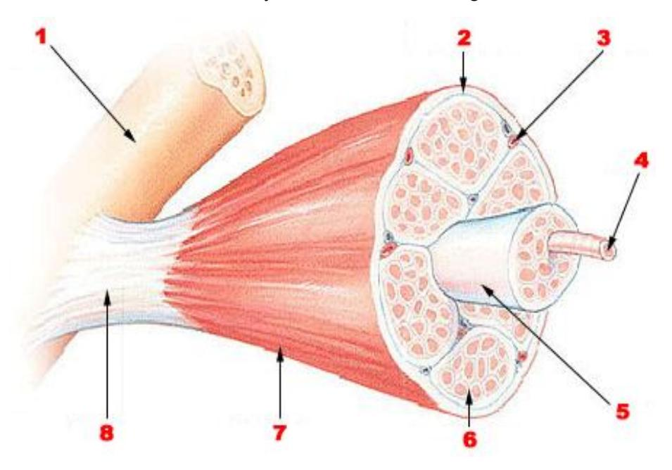

**Figure 10.3** Unlabeled Skeletal Muscle.

**Table 10.1 Structure Identification**

## Muscle Structure Identification

| Structure Number | Structure Identification |
|------------------|--------------------------|
| 1                | Organ: Skeletal muscle |
| 2                | Connective tissue layer: Epimysium |
| 3                | Organelle: Nucleus |
| 4                | Structure name: Muscle fiber |
| 5                | Bundle: Fascicle |
| 6                | Connective tissue layer: Perimysium |
| 7                | Connective tissue layer: Endomysium |
| 8                | Structure: Myofibril |

### Label the following structures of the skeletal muscle:

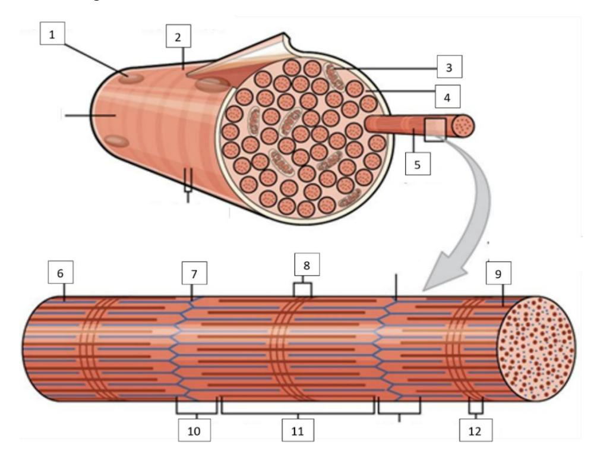

**Figure 10.4** Unlabeled Muscle Fiber.

**Table 10.2 Muscle Histology Identification**
## Myofibril / Muscle Fiber Identification

| Structure Number | Structure Identification |
|------------------|--------------------------|
| 1                | Organelle: Mitochondria |
| 2                | Surface layer: Sarcolemma |
| 3                | Organelle: Nucleus |
| 4                | Internal gel: Sarcoplasm |
| 5                | Filament name: Actin |
| 6                | Filament type: Thin filament |
| 7                | Line: Z disc |
| 8                | Band: I band |
| 9                | Filament type: Thick filament (myosin) |
| 10               | Band: A band |
| 11               | Band: H zone |
| 12               | Band: M line |
## **Lab Activities**

## **Skeletal Muscle Cell Microscopic Structure and Gross Structures**

## **Muscle Tissue Types**

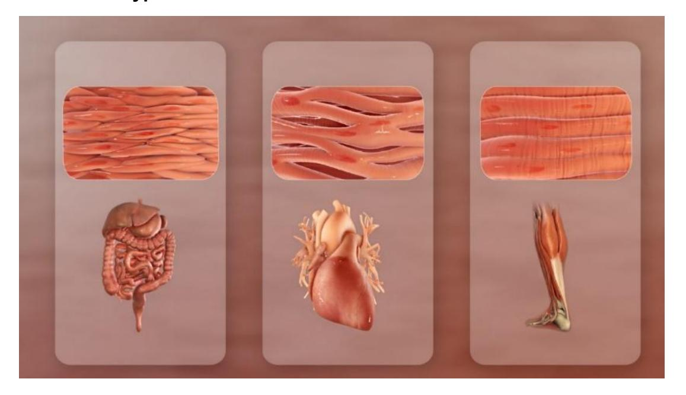

**Figure 10.5** Three Muscle Types (L to R: Smooth, Cardiac, and Skeletal Muscles).

## **Lab Activity 10.1**

## Compare Muscle Tissue Types

### Summary Comparison

| Feature | Skeletal Muscle | Smooth Muscle | Cardiac Muscle |
|--------|-----------------|---------------|----------------|
| Location | Attached to bones | Walls of organs | Heart |
| Shape | Long, cylindrical | Spindle-shaped | Branching |
| Control | Voluntary | Involuntary | Involuntary |
| Striations | Yes | No | Yes |
| Nuclei | Multiple | Single | Single |
| Special features | Movement | Organ contraction | Intercalated discs |

---

## Lab Activity (Microscope Observations)

- Skeletal muscle: **visible striations, multiple nuclei**  
- Smooth muscle: **no striations, spindle shape**  
- Cardiac muscle: **striations + branching + intercalated discs**  

---

## Drawing Table

| Cell type: Skeletal Muscle | Cell type: Smooth Muscle |
|----------------------------|--------------------------|
| Magnification: 400x        | Magnification: 400x      |
| Long fibers, striated, multinucleated | Spindle-shaped, no striations |

| Cell type: Cardiac Muscle | Cell type: |
|---------------------------|------------|
| Magnification: 400x       | Magnification: |
| Branching cells, striated, intercalated discs | |

The following cells may be used for review after class. Virtual muscle review source from University of Michigan Virtual Microscope:

https://histology.medicine.umich.edu/

-   Skeletal muscle, longitudinal section, H&E, 83X: [https://histologyslides.med.umich.edu/Histology/Basic%20Tissues/Muscle/05](https://histologyslides.med.umich.edu/Histology/Basic%20Tissues/Muscle/058thin_HISTO_83X.htm) [8thin\\\_HISTO\\\_83X.htm](https://histologyslides.med.umich.edu/Histology/Basic%20Tissues/Muscle/058thin_HISTO_83X.htm)
-   Heart, ventricle, H&E, 40X (cardiac muscle, intercalated discs). See Cardiovascular section. [https://histologyslides.med.umich.edu/Histology/Cardiovascular%20System/0](https://histologyslides.med.umich.edu/Histology/Cardiovascular%20System/098-1_HISTO_40X.htm) [98-1\\\_HISTO\\\_40X.htm](https://histologyslides.med.umich.edu/Histology/Cardiovascular%20System/098-1_HISTO_40X.htm)
-   Smooth muscle, Esophagus and stomach, H&E, 40X [https://histologyslides.med.umich.edu/Histology/Digestive%20System/Pharyn](https://histologyslides.med.umich.edu/Histology/Digestive%20System/Pharynx%20Esophagus%20and%20Stomach/155_HISTO_40X.htm) [x%20Esophagus%20and%20Stomach/155\\\_HISTO\\\_40X.htm](https://histologyslides.med.umich.edu/Histology/Digestive%20System/Pharynx%20Esophagus%20and%20Stomach/155_HISTO_40X.htm)

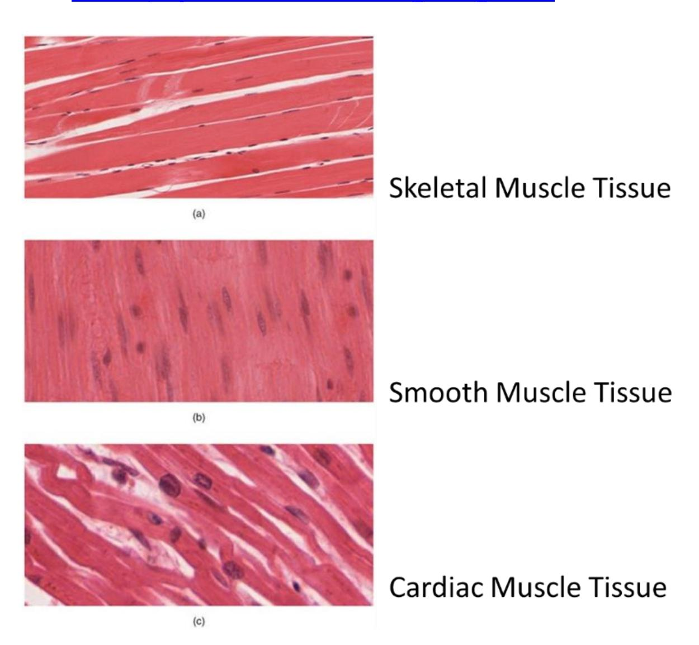

**Figure 10.6** Three Types of Muscle Fibers.

## **Gross Anatomy of a Muscle**

## **Lab Activity 10.2**

Identify the following terms on a diagram or model.

-   Go to the area where the models are kept and obtain the model of the microanatomy human muscle fiber.
-   Collaborate with your group to identify and label the structures found in the regions of the outer, middle, and inner ear.
-   Invite the group next to you to check your work, then have your instructor check your work.
-   Take a picture of the work for later reference before the upcoming practical and if you have time have a classmate record a video while you review the structures of the ear you need to review.

## **Identify the Following Muscle Structures**

-   Muscle layers
    -   Muscle fiber
    -   Fascicle
    -   Myofibril
-   Connective tissue layers
    -   Epimysium
    -   Perimysium
    -   Endomysium
-   Other structures
    -   Tendon
    -   Aponeurosis

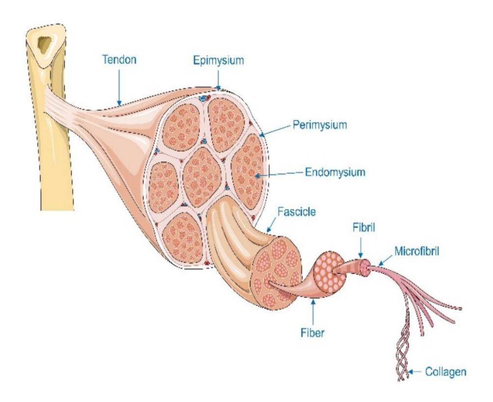

**Figure 10.7** Connective Tissue Layers in a Muscle.

## **Muscle Fiber Organization**

## **Lab Activity 10.3**

-   Using the model of the microanatomy human muscle fiber.
-   Locate and label the muscle features listed below.
-   Invite the group next to you to review your model identifications for correctness.
-   Finally take pictures of the model toad to your study guide.

## **Sarcomere Structures in the Myofibril**

### **Terms**

Sarcolemma Sarcoplasm Sarcoplasmic reticulum T tubules Nuclei Mitochondria Myofibril

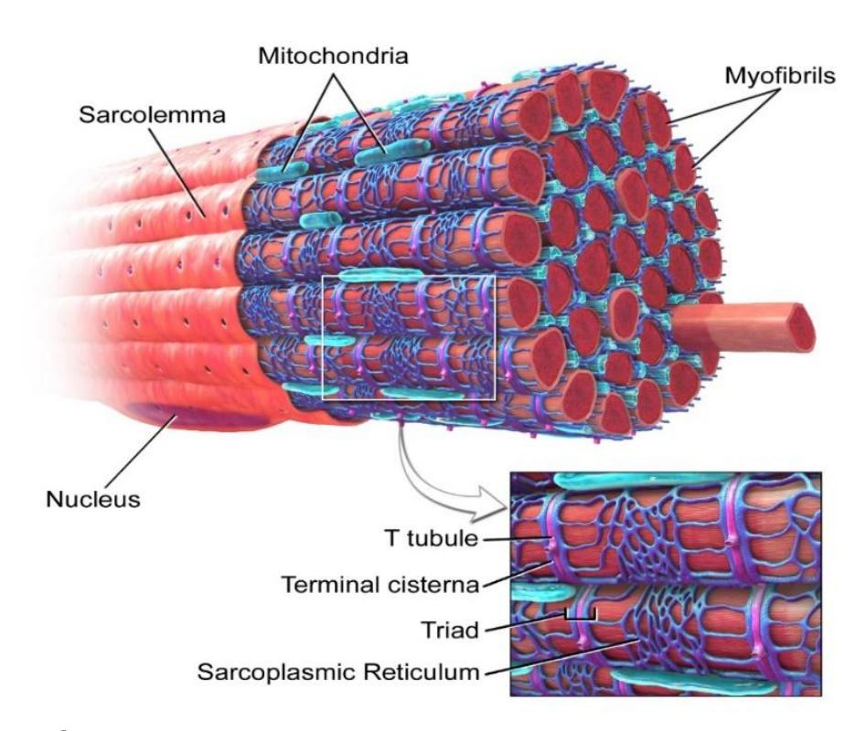

**Figure 10.8** Skeletal Muscle Fiber.

## Lab Activity 10.4 – Sarcomere

### Structures and Functions

- Sarcomere **functional unit of muscle contraction (Z disc to Z disc)**  
- A band **dark region; contains thick + thin filaments**  
- I band **light region; thin filaments only**  
- Z disc (Z line) **boundary of sarcomere; anchors actin**  
- H zone **center region; thick filaments only**  
- M line **middle of sarcomere; anchors myosin**  
- Thick filament **myosin; pulls actin during contraction**  
- Myosin **motor protein that generates force**  
- Thin filament **actin + regulatory proteins**  
- Actin **protein that slides during contraction**  
- Troponin **binds calcium; allows contraction to start**  
- Tropomyosin **blocks/unblocks actin binding sites**  

---

### Quick Video Script (5 min)

- The **sarcomere** is the basic unit of muscle contraction.  
- It extends from one **Z disc to another Z disc**.  
- The **A band** is dark because it contains both thick and thin filaments.  
- The **I band** is light because it has only thin filaments.  
- The **H zone** is the center region with only thick filaments.  
- The **M line** holds the thick filaments together.  
- During contraction, **myosin pulls actin**, shortening the sarcomere.  
- **Troponin and tropomyosin regulate** this process using calcium.  

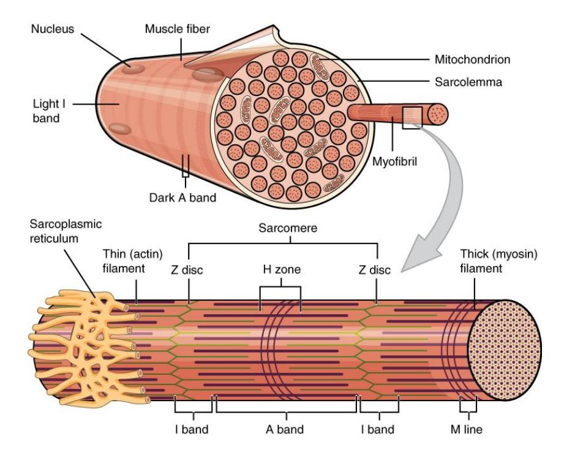

**Figure 10.9** Organization of a Muscle Fiber.

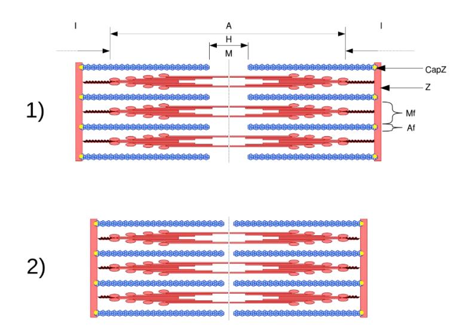

**Figure 10.10** Sarcomere Structure in the 1) Relaxed and 2) Contracted States

## **The Neuromuscular Junction**

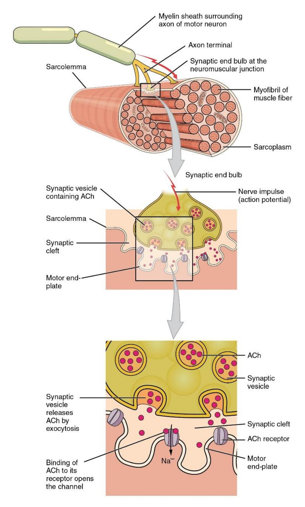

**Figure 10.11** The Neuromuscular Junction.

## **Review Videos**

-   Muscle microanatomy:<https://youtu.be/E9cNTG7oe88>
-   Visible Body \| The Structure of Skeletal Muscle: [**https://youtu.be/TUD\\\_wlAB5Z0**](https://youtu.be/TUD_wlAB5Z0)
-   Anatomy of a muscle cell; Khan Academy [**https://youtu.be/uY2ZOsCnXIA**](https://youtu.be/uY2ZOsCnXIA){.uri}
-   [Skeletal Muscle Microanatomy](https://www.youtube.com/watch?v=YhUVOkGpgJs) [Anatomy BIO2113:](https://www.youtube.com/@AnatomyBIO-mw9rx) <https://youtu.be/YhUVOkGpgJs>

### **Review Materials**

**Virtual Muscle Material Source:** University of Michigan Virtual Microscope: https://histology.medicine.umich.edu/

-   Skeletal muscle, longitudinal section, H&E, 83X: [https://histologyslides.med.umich.edu/Histology/Basic%20Tissues/Muscle/05](https://histologyslides.med.umich.edu/Histology/Basic%20Tissues/Muscle/058thin_HISTO_83X.htm) [8thin\\\_HISTO\\\_83X.htm](https://histologyslides.med.umich.edu/Histology/Basic%20Tissues/Muscle/058thin_HISTO_83X.htm)
-   Heart, ventricle, H&E, 40X (cardiac muscle, intercalated discs). See Cardiovascular section. [https://histologyslides.med.umich.edu/Histology/Cardiovascular%20System/0](https://histologyslides.med.umich.edu/Histology/Cardiovascular%20System/098-1_HISTO_40X.htm) [98-1\\\_HISTO\\\_40X.htm](https://histologyslides.med.umich.edu/Histology/Cardiovascular%20System/098-1_HISTO_40X.htm)
-   Smooth muscle, Esophagus and stomach, H&E, 40X [https://histologyslides.med.umich.edu/Histology/Digestive%20System/Pharyn](https://histologyslides.med.umich.edu/Histology/Digestive%20System/Pharynx%20Esophagus%20and%20Stomach/155_HISTO_40X.htm) [x%20Esophagus%20and%20Stomach/155\\\_HISTO\\\_40X.htm](https://histologyslides.med.umich.edu/Histology/Digestive%20System/Pharynx%20Esophagus%20and%20Stomach/155_HISTO_40X.htm)

## **Post Lab Activities**

## **Check Your Understanding**

## **Post Lab Activity 10.1**

## **Matching**

## Table 10.1 Identify the Muscle Tissue Type

| Answers | Characteristics                       | Choices  |
|---------|---------------------------------------|----------|
| Cardiac, Smooth | Involuntary                           | Cardiac  |
| Skeletal, Cardiac | Banded/striated                       | Smooth   |
| Cardiac | Coordinated activity – acts in a pump | Skeletal |
| Skeletal | Moves facial skin and the bones       |          |
| Skeletal | Voluntary                             |          |
| Smooth | Tapered                               |          |
| Smooth | Longitudinal and circular layers      |          |
| Skeletal | Cord-like                             |          |
| Skeletal | Multiple nuclei                       |          |
| Cardiac | Branched                              |          |
| Smooth, Cardiac | Single nucleus                        |          |

---

## Table 10.2 Identify the Fascia Type

| Answers | Definitions | Choices |
|---------|------------------------|------------------------|
| Sarcolemma | Muscle fiber cell membrane | Endomysium |
| Epimysium | Surrounds the whole muscle | Perimysium |
| Epimysium | Connective tissue that covers the body under the skin and whole muscles | Exomysium |
| Endomysium | Thin layer around muscle fiber | Sarcolemma |
| Perimysium | Surrounds a group of fascicles | Facia |
## **Post Lab Activity 10.2**

#### Identification

Identify and label the parts of the myofibril.

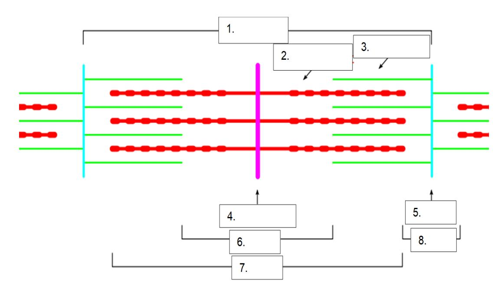
## Figure 10.12 Unlabeled Sarcomere

1. Sarcomere  
2. Z disc (Z line)  
3. I band  
4. A band  
5. H zone  
6. M line  
7. Thin filament (actin)  
8. Thick filament (myosin)  

## **Post Lab Activity 10.3**

### **Crossword Puzzles**

Complete the crossword puzzles.

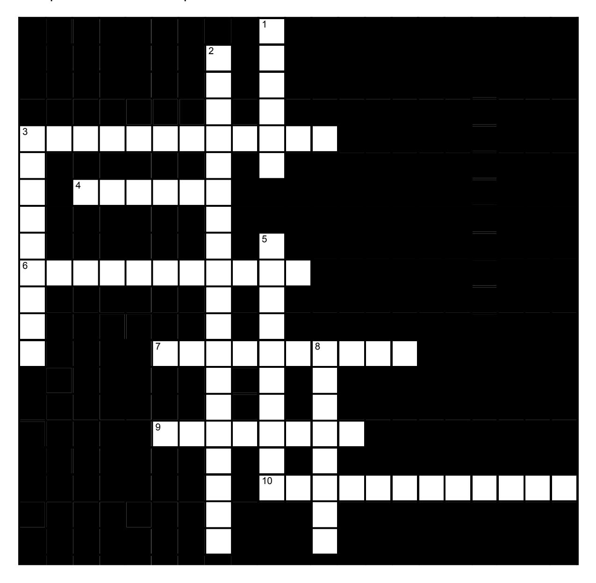

## Figure 10.13 – Skeletal Muscle Fibers Crossword

### Across

- 3 Smooth, nonstriated  
- 4 Fibers  
- 6 Myofilaments  
- 7 Perimysium  
- 9 Fascicle  
- 10 Mitochondria  

### Down

- 1 Tendon  
- 2 Epimysium, periosteum  
- 3 Sarcomere  
- 5 Endomysium  
- 8 Skeletal  
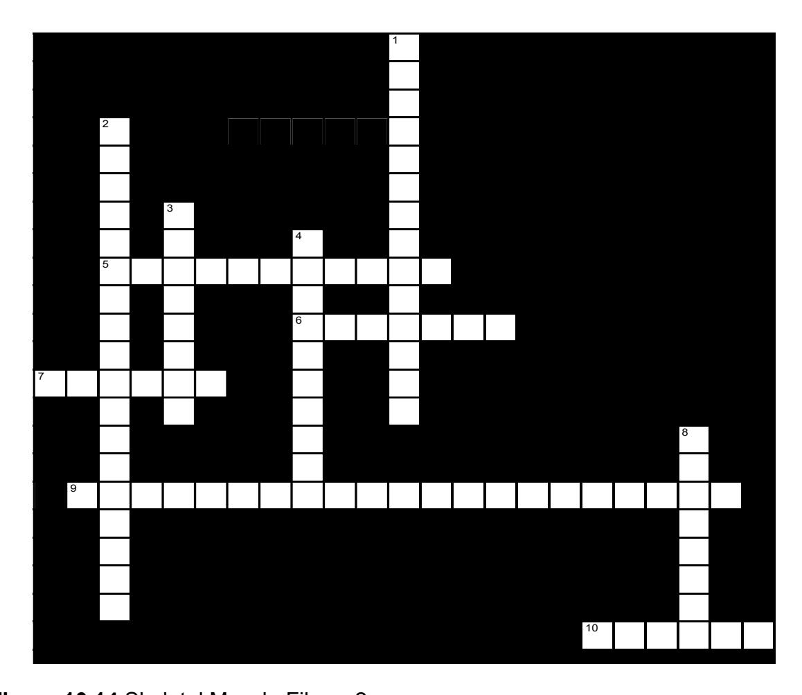

## Figure 10.14 – Skeletal Muscle Fibers-2

### Across

- 5 Myofilaments  
- 6 Release  
- 7 Myosin  
- 9 Sarcoplasmic reticulum  
- 10 Z discs  

### Down

- 8 Multiple nuclei  
## **Crossword Puzzle Solutions**

## **Figure 10.13. Skeletal muscle fibers.**

-   **Across: 5** Myofilament, **6** Calcium, **7** Myosin, **9** Sarcoplasmic reticulum, **10** Z disks.
-   **Down: 1** Multiple nuclei, **2** Actin microfilament, **3** Troponin, **4** Sarcolemma, **8** T tubules.

## **Figure 10.14. Skeletal muscle fibers 2.**

-   **Across: 3** Smooth smooth, **4** Fibers, **6** Myofilament, **7** Perimysium, **9** Fascicle, **10** Mitochondria.
-   **Down: 1** Tendon, **2** Epimysium periosteum, **3** Sarcomere, **5** Endomysium, **8** Skeletal.

**Chapter 10: Skeletal Muscle Histology and Microanatomy Glossary**

| Terms | Definitions |
|------------------------------------|------------------------------------|
| acetylcholine (ACh) | neurotransmitter that binds at a motor endplate to trigger depolarization |
| actin | protein that makes up most of the thin myofilaments in a sarcomere muscle fiber |
| action potential | change in voltage of a cell membrane in response to a stimulus that results in transmission of an electrical signal; unique to neurons and muscle fibers |
| aerobic respiration | production of ATP in the presence of oxygen |
| aponeurosis | tendon-like sheet of connective tissue that attaches a skeletal muscle to another skeletal muscle or to a bone |
| ATPase | enzyme that hydrolyzes ATP to ADP |
| atrophy | loss of structural proteins from muscle fibers |
| cardiac muscle | striated muscle found in the heart; joined to one another at intercalated discs and under the regulation of pacemaker cells, which contract as one unit to pump blood through the circulatory system. Cardiac muscle is under involuntary control. |
| concentric contraction | muscle contraction that shortens the muscle to move a load |
| contractility | ability to shorten (contract) forcibly |
| contraction phase twitch | contraction phase when tension increases |
| creatine phosphate | phosphagen used to store energy from ATP and transfer it to muscle |
| depolarize | to reduce the voltage difference between the inside and outside of a cell's plasma membrane (the sarcolemma for a muscle fiber), making the inside less negative than at rest |
| desmosome | structure that anchors the ends of cardiac muscle fibers to allow contraction to occur |
| eccentric contraction | muscle contraction that lengthens the muscle as the tension is diminished |
| elasticity | ability to stretch and rebound |
| endomysium | loose, and well-hydrated connective tissue covering each muscle fiber in a skeletal muscle |
| epimysium | outer layer of connective tissue around a skeletal muscle |
| excitability | ability to undergo neural stimulation |
| excitation-contraction coupling | sequence of events from motor neuron signaling to a skeletal muscle fiber to contraction of the fiber's sarcomeres |
| extensibility | ability to lengthen (extend) |
| fascicle | bundle of muscle fibers within a skeletal muscle |
| fast glycolytic (FG) muscle | fiber that primarily uses anaerobic glycolysis |
| fast oxidative (FO) intermediate muscle | fiber that is between slow oxidative and fast glycolytic fibers |
| fibrosis | replacement of muscle fibers by scar tissue |
| glycolysis | anaerobic breakdown of glucose to ATP |
| H zone | The H zone is the bright region of the A band in a sarcomere that only has thick filaments. |
| hyperplasia | process in which one cell splits to produce new cells |
| hypertrophy | addition of structural proteins to muscle fibers |
| hypotonia | abnormally low muscle tone caused by the absence of low-level contractions |
| I band | I band is the light band of the sarcomere in skeletal muscle tissue that contains actin filaments. |
| intercalated disc | part of the sarcolemma that connects cardiac tissue, and contains gap junctions and desmosomes |
| isometric contraction | muscle contraction that occurs with no change in muscle length |
| isotonic contraction | muscle contraction that involves changes in muscle length |
| lactic acid | product of anaerobic glycolysis |
| latent period | the time when a twitch does not produce contraction |
| M line | the center of the sarcomere that runs through the middle of the myosin filaments |
| motor endplate | sarcolemma of muscle fiber at the neuromuscular junction, with receptors for the neurotransmitter acetylcholine |
| motor unit | motor neuron and the group of muscle fibers it innervates |
| Muscle fiber | the individual cells that make up muscle tissue, specifically skeletal muscle, which is responsible for voluntary movements in the body. |
| muscle tension | force generated by the contraction of the muscle; tension generated during isotonic contractions and isometric contractions |
| muscle tone | low levels of muscle contraction that occur when a muscle is not producing movement |
| myoblast | muscle-forming stem cell |
| myofibril | long, cylindrical organelle that runs parallel within the muscle fiber and contains the sarcomeres |
| myosin | protein that makes up most of the thick cylindrical myofilament within a sarcomere muscle fiber |
| neuromuscular junction (NMJ) | synapse between the axon terminal of a motor neuron and the section of the membrane of a muscle fiber with receptors for the acetylcholine released by the terminal |
| neurotransmitter signaling | chemical released by nerve terminals that bind to and activate receptors on target cells |
| oxygen debt | amount of oxygen needed to compensate for ATP produced without oxygen during muscle contraction |
| perimysium | connective tissue that bundles skeletal muscle fibers into fascicles within a skeletal muscle |
| power stroke | action of myosin pulling actin inward(toward theM line) |
| pyruvic acid | product of glycolysis that can be used in aerobic respiration or converted to lactic acid |
| recruitment | increase in the number of motor units involved in contraction |
| relaxation phase | period after twitch contraction when tension decreases |
| sarcolemma | plasma membrane of a skeletal muscle fiber |
| sarcomere | longitudinally, repeating functional unit of skeletal muscle, with all of the contractile and associated proteins involved in contraction |
| sarcoplasm | cytoplasm of a muscle cell |
| sarcoplasmic reticulum (SR) | specialized smooth endoplasmic reticulum, which stores, releases, and retrieves Ca++ |
| satellite cell stem | cell that helps to repair muscle cells |
| skeletal muscle | striated, multinucleated muscle that requires signaling from the nervous system to trigger contraction; most skeletal muscles are referred to as voluntary muscles that move bones and produce movement |
| slow oxidative (SO) muscle | fiber that primarily uses aerobic respiration |
| smooth muscle | nonstriated, mononucleated muscle in the skin that is associated with hair follicles; assists in moving materials in the walls of internal organs, blood vessels, and internal passageways |
| synaptic cleft | space between a nerve (axon) terminal and a motor endplate |
| T-tubule | projection of the sarcolemma into the interior of the cell |
| tendon | a tough band of connective tissue that connects muscles to bones |
| tetanus | a continuous fused contraction |
| thick filament | thick filament the thick myosin strands and their multiple heads projecting from the center of the sarcomere toward, but not all to way to, the Z-discs |
| thin filament | thin filament thin strands of actin and its troponin-tropomyosin complex projecting from the Z-discs toward the center of the sarcomere |
| treppe | stepwise increase in contraction tension |
| triad | the grouping of one T-tubule and two terminal cisternae |
| tropomyosin | regulatory protein that covers myosin binding sites to prevent actin from binding to myosin |
| troponin | regulatory protein that binds to actin, tropomyosin, and calcium |
| twitch | single contraction produced by one action potential |
| visceral muscle | smooth muscle found in the walls of visceral organs |
| voltage-gated sodium channels | proteins that open sodium channels in response to a sufficient voltage change, and initiate and transmit the action potential as Na+ enters through the channel |
| wave summation | addition of successive neural stimuli to produce greater contraction |
| Z disc (z line) | a boundary within the sarcomere, marking the ends of each unit. |
